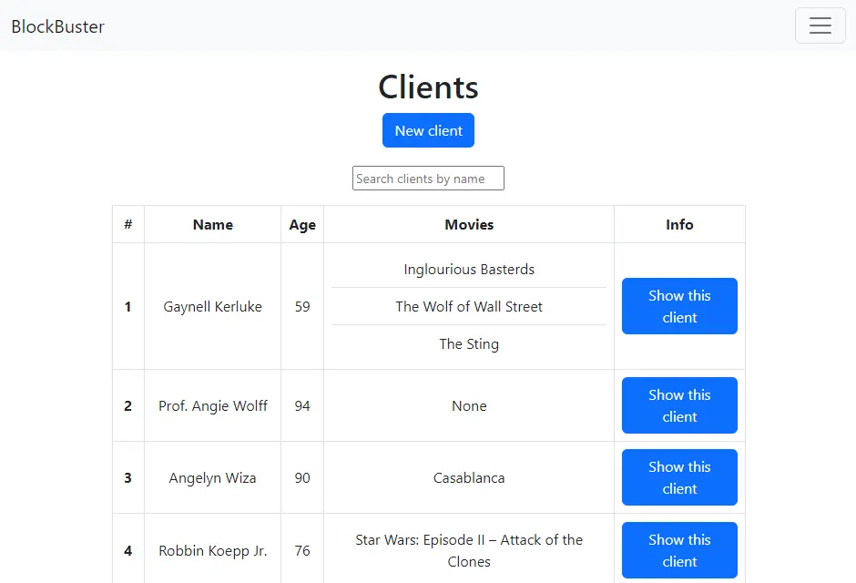
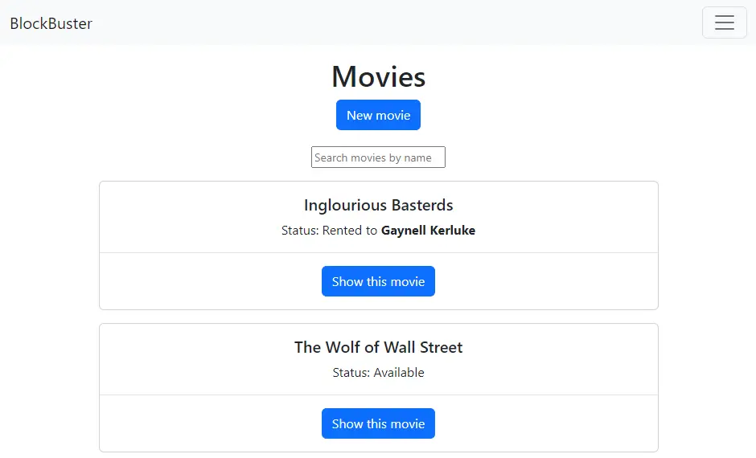
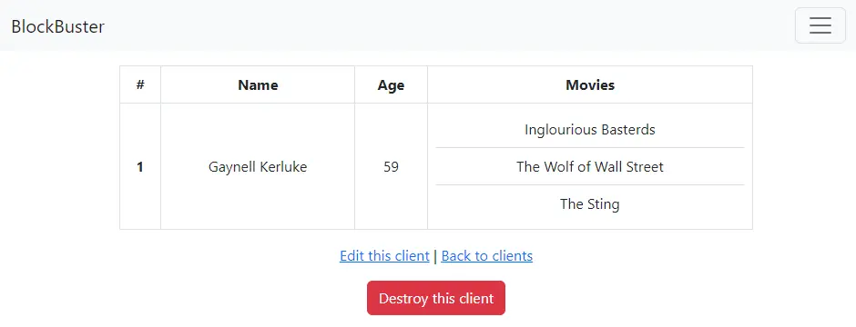
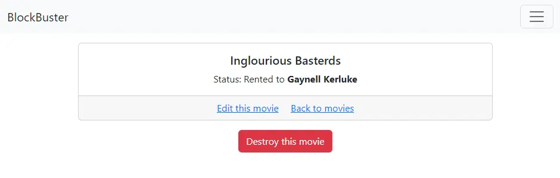
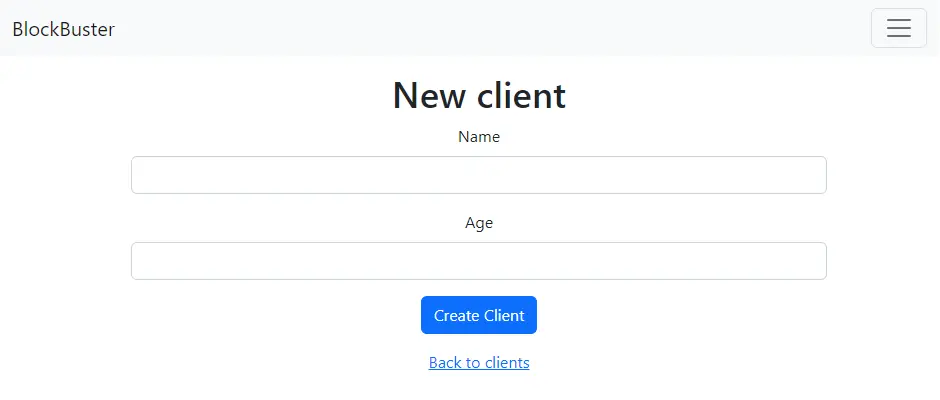
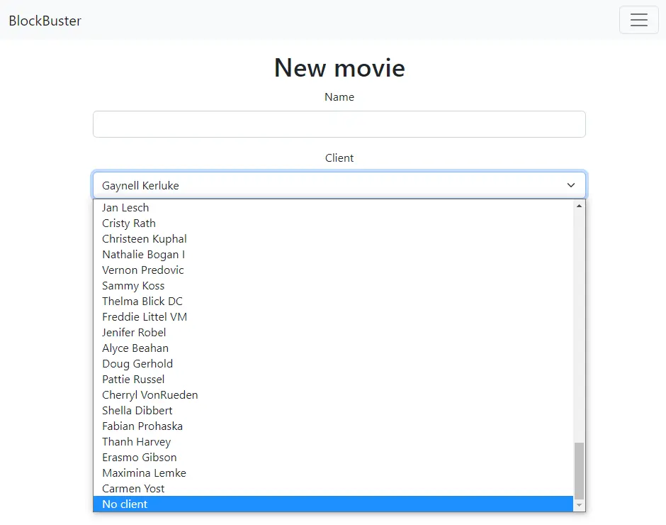
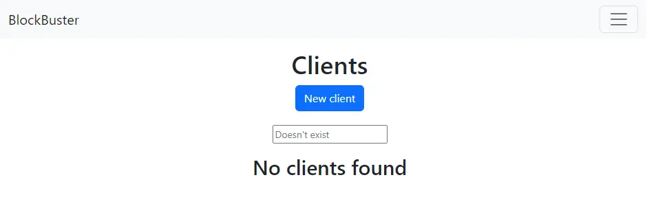
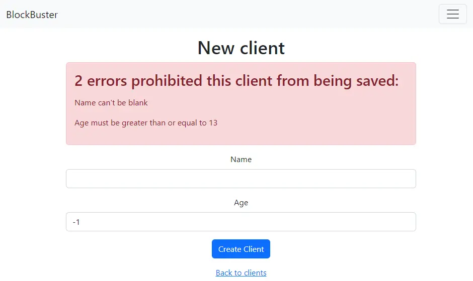

# Not Blockbuster

Aplicación web de arriendo de películas hecha con Ruby on Rails

## Descripción

Aplicación que busca crear un sistema de arriendos de películas para el desafío "Relaciones 1 a N en los modelos".

A través de esta aplicación es posible asignar distintas películas a un cliente, pero cada película no puede ser arrendada por más de uno de ellos.

## Vistas

### Index clientes


### Index películas


### Vista cliente


### Vista película


### Nuevo cliente


### Nueva película


### Caso: Búsqueda no encuentra resultados


### Caso: Error por datos incorrectos



## Deployment en Heroku vía CLI

* Iniciar sesión con ```heroku login```
* Crear aplicación con ```heroku create```
* Conectar con la aplicación con ```heroku git:remote -a nombre_aplicación```
* Subir aplicación con ```git push heroku main```
* Ejecutar migración con ```heroku run rails db:migrate```
* Ejecutar seed de datos con ```heroku run rails db:seed```

## Software utilizado

Ruby 3.1.1  
Rails 7.0.4  
PostgreSQL 14.8  
Bootstrap 5.2.2  

### Gemas

Faker 2.23  
Annotate 3.2  
Pagy 6.0.4  
PgSearch 2.3.6  
